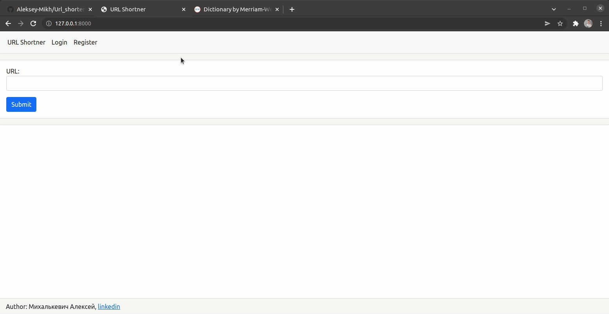
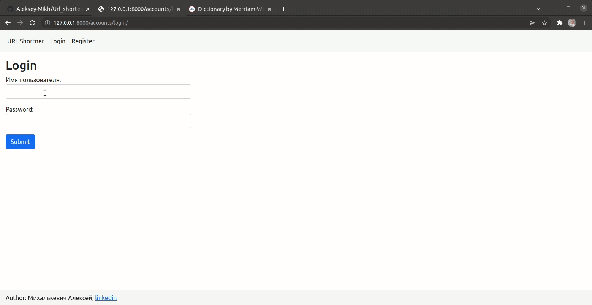

Задание
------------------------------
[Требования](Task/README.md)


Тестовое Django
------------------------------
```
pip install -r requirements.txt
```
Укорачивание URL:


Регистрация и профиль:


---
Тестовое SQL
--------------------------------------
Задание 1:

    SELECT client_number, sum(if(outcome = 'win', 1, 0)) as 'Побед', sum(if(outcome = 'lose', 1, 0)) as 'Поражений'
    FROM 
        bid 
        INNER JOIN event_entity USING(play_id)
        INNER JOIN event_value USING(play_id)
    WHERE coefficient = event_value.value
    GROUP BY client_number;

Задание 2:

    USE test_import;
    SELECT CONCAT(home_team, '-', away_team) AS game, count(play_id) as games_count
    FROM event_entity
    group by home_team, away_team
    ORDER BY games_count;